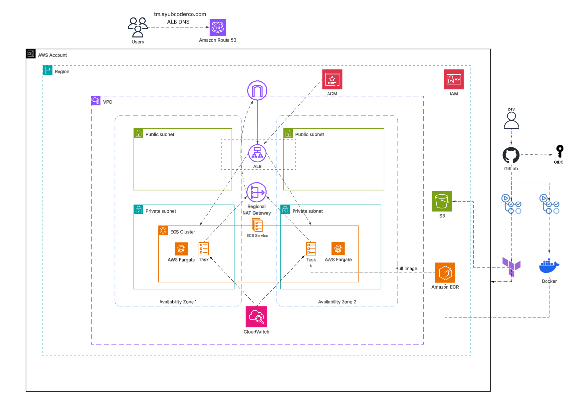
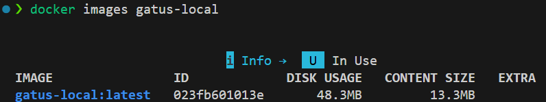
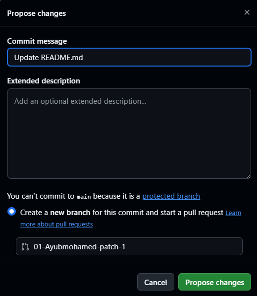
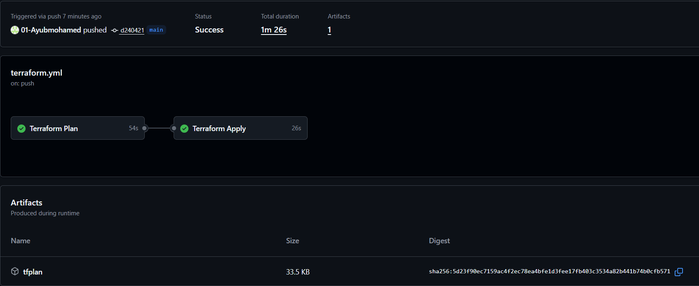
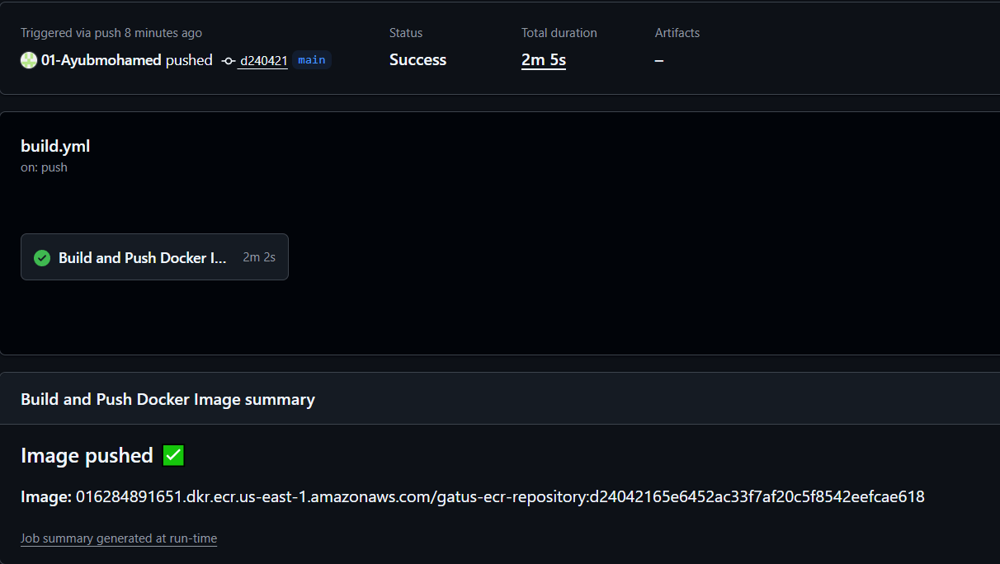
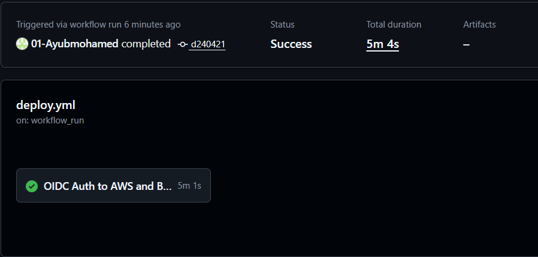
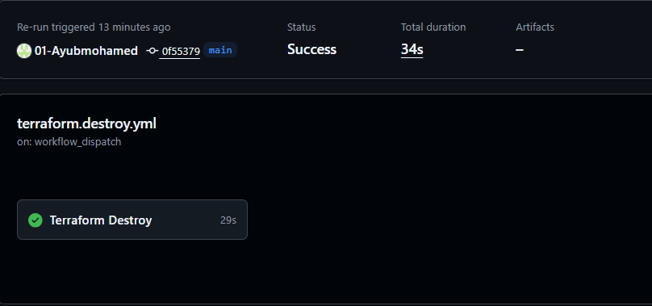

# Self-Hosted Gatus Monitoring on AWS ECS Fargate

## Overview

This project delivers a Gatus monitoring application, hosted on AWS, provisioned using Terraform infrastructure-as-code (IaC), and deployed via GitHub Actions. This introduces a highly available, fault-tolerant architecture, with a custom domain resolved through Route 53.  

## Architecture



## Live Demo

https://github.com/user-attachments/assets/de26553d-df30-4a47-a1b8-205add41835c


## Design Features

* **Two Stage Terraform Split:** Terraform is split into two stages to tackle the circular dependency, or chicken-and-egg problem. `bootstrap` (state bucket, ECR, IAM, and OpenID Connect provider (OIDC)) and `infra` (VPC, ALB, ACM, ECS) are split. Terraform pipelines need a remote state bucket, but that same pipeline needs to run/manage infrastructure. To solve this, `bootstrap` is applied once manually to create a base resource, then everything in `infra` runs through CI/CD.

* **CI/CD Authentication:** Every pipeline (build, deploy, terraform) is authenticated through AWS via GitHub using short-lived access tokens (OIDC). Each role is scoped to the exact permission required, following Role-Based Access Control (RBAC) protocols. Invisible weaknesses in the cloud environment are avoided by not storing static AWS credentials in the repository. 

* **Immutable SHA Tagged Images:** ECR images are identified by a tag, a function that works as a pointer to the latest version, whereas commit SHA tags an image with a unique identifier. Implementing commit SHA tags means any image can be traced back to exact commits, making rollback and debugging easier. `image_tag_mutability` is added as a safety measure to block any tag from being overwritten once pushed.  

* **Minimal Attack Surface:** The final image builds `FROM scratch`, a reserved image that tells the build process to start an empty container, with no folders, packages and shell. It also runs as a non root user, a fundamental security approach that limits the blast radius of the container. 

* **High Availability, Secure Routing:** The ECS service distributes the workload across two Availability Zones (AZs), behind an Application Load Balancer (ALB). HTTP is redirected to HTTPS via ALB listener rules and authenticated by an SSL/TLS certificate. This is provisioned by AWS Certificate Manager (ACM) and validated by Route 53. Security groups are tightly asymmetric, meaning the ALB can reach the tasks, while the tasks can only reach approved ports. 

* **Fault Tolerance:** One regional NAT Gateway is provisioned for multi-AZ infrastructure, rather than a zonal NAT Gateway. This achieves fault tolerance by automatically expanding to AZs where workloads run, while maintaining architectural simplicity. 

## Project Layout

```
.
├── .github/
│   └── workflows/
│       ├── build.yml
│       ├── deploy.yml
│       ├── terraform.yml
│       └── terraform.destroy.yml
├── Images/
├── app/
├── bootstrap/
│   ├── main.tf
│   ├── provider.tf
│   ├── variable.tf
│   ├── output.tf
│   ├── terraform.tfvars
│   └── modules/
│       ├── s3/
│       ├── ecr/
│       └── iam/
├── config/
│   └── config.yaml
├── infra/
│   ├── main.tf
│   ├── provider.tf
│   ├── variable.tf
│   ├── output.tf
│   ├── terraform.tfvars
│   └── modules/
│       ├── vpc/
│       ├── acm/
│       ├── alb/
│       ├── ecs/
│       └── iam/
├── .dockerignore
├── .gitignore
├── Dockerfile
└── README.md
```

## Security

* **OIDC Over Static Credentials:** GitHub’s OIDC provider is used to authenticate pipelines, by using a short-lived access token that expires after a period. Each role is permission-specific and scoped to exactly what is required.  

* **Scanned Before It Ships:** For security, this project implements two layers of scanning before shipping. Grype evaluates the image for vulnerabilities during the build, while Checkov scans Terraform IaC for security misconfiguration and compliance issues.   

* **Encryption at Rest:** This project applies AWS Managed Keys to encrypt the Terraform state bucket and ECR repository. 

* **TLS Enforced at the Load Balancer:** The ALB uses the latest modern policy, TLS 1.3, with 1.2 as a fallback. This version is faster by cutting setup time and blocking obsolete ciphers. 

* **Locked Down VPC:** The default VPC security group assigned by AWS is updated to remove all permissive rules. `public_subnets` set `map_public_ip_on_launch = false`, blocking default public IPs. ALB and ECS security groups are tightly scoped to the traffic required. 

* **Branch Protection:** Branch protection restrictions and rules were applied to safeguard changes to `main`. PRs need to pass checks before anything is integrated into `main`. This blocks force pushes, branch deletion and live infrastructure changes without verification. 

## Cost Optimisations

- ECS Fargate was selected instead of EC2 for easier management of provisioning, scaling, and costs. With Fargate, you avoid operational overhead costs for idle capacity and server maintenance while gaining automated task-level scaling. 

- ECR (SHA tagged images), S3 (Terraform state versions) and CloudWatch (logs) all have data billed for storage. Each resource has a lifecycle policy that triggers data deletion and expiration after a set number of days. 

- AWS Managed KMS keys are used instead of Customer Managed Keys (CMK), avoiding the charge incurred per key used. 

## Known Limitations and Trade Offs 

- `CKV_AWS_150` is a Checkov security warning that checks if the ALB has deletion protection. Enabling this protection would block the Terraform destroy pipeline, undermining our aim for an on demand teardown.

- `CKV_DOCKER_2` is triggered when a Dockerfile is missing a HEALTHCHECK. Since the final stage build is designed to be minimal and has no shell to run one, health is instead verified by the ALB target group's own health checks.

- `CKV_GHA_7` is a Checkov warning concerning destroy workflow confirmation input. This is an intended configuration and not a flaw requiring change. A `yes` input before destroy commences is a safety measure to avoid accidental destruction of infrastructure. As extra security, input is passed as an environment variable, where the input data is treated as data to be compared and never as text syntax spliced into the script to be executed as code. 

- CloudWatch log group encryption uses the default rather than a CMK (`CKV_AWS_158`). Unlike S3 and ECR, which have a free AWS Managed key available, CloudWatch Logs would need a dedicated key and key policy for real ongoing cost.

## How to Build

### Required

* **1. AWS Account and CLI:** Sign up at aws.amazon.com. Create an IAM user with the necessary permissions, then install the AWS CLI from docs.aws.amazon.com/cli and configure it locally with `aws configure`.
`aws sts get-caller-identity`
Outcome: prints your Account ID, User ID, and ARN, confirming the CLI is authenticated.

* **2. Terraform:** Install from developer.hashicorp.com/terraform/install, matching the `~> 1.15` version this project targets.
`terraform --version`
Outcome: `Terraform v1.15.x`

* **3. Docker:** Docker Desktop (Mac/Windows) or Docker Engine (Linux), used to build and test the image locally. Install from docs.docker.com/get-docker.
`docker --version`
Outcome: prints a version string. If you instead see `Cannot connect to the Docker daemon`, the engine isn't running yet.

* **4. GitHub:** Create a free account at github.com if you don't already have one, used to host the repository and run the pipelines.

* **5. Route 53 Domain:** A registered domain with an existing Route 53 hosted zone, needed for the ACM certificate and DNS record `infra/` creates.

### 1. Local Setup

```bash
git clone https://github.com/01-Ayubmohamed/ecs-project.git
cd ecs-project
```

```bash
docker build -t gatus-local -f Dockerfile .
docker run -d -p 8080:8080 --name gatus-local gatus-local
curl http://localhost:8080/health
```

```bash
docker stop gatus-local && docker rm gatus-local
```

### 2. Bootstrap Setup

File: `bootstrap/terraform.tfvars`

Variables to set:
- `aws_region`
- `name`
- `bucket_name`
- `allowed_subjects`
- `ecs_task_role_name`
- `ecs_task_execution_role_name`

```bash
cd bootstrap
terraform init
terraform plan
terraform apply
```

### 3. Infra Setup

File: `infra/provider.tf` (backend block, `bucket` must match bootstrap's `bucket_name`)

File: `infra/terraform.tfvars`

Variables to set:
- `aws_region`
- `cidr_block`
- `public_subnets`
- `private_subnets`
- `name`
- `domain_name`
- `hosted_zone_name`
- `alb_sg`
- `container_name`
- `container_image`
- `container_cpu`
- `container_memory`
- `container_port`
- `desired_count`

### 4. GitHub Configuration

On your repository page, click **Settings** in the top menu bar. In the left sidebar under **Security**, click **Secrets and variables**, then **Actions**. There are two tabs, **Secrets** and **Variables**.

Under the **Secrets** tab, click **New repository secret** for each of these, using the matching output from the bootstrap apply:
- `BUILD_ROLE_ARN`
- `DEPLOY_ROLE_ARN`
- `TERRAFORM_ROLE_ARN`

Under the **Variables** tab, click **New repository variable** for each of these:
- `AWS_REGION`
- `ECR_REPOSITORY`
- `ECS_CLUSTER`
- `ECS_SERVICE`
- `CONTAINER_NAME`
- `DOMAIN_URL`

### 5. Pipeline Automations

```bash
git checkout -b my-first-change
git add .
git commit -m "test pipeline"
git push -u origin my-first-change
```

Open a pull request on GitHub, `terraform.yml` runs as a check. Merge it, `terraform.yml` applies `infra/`, `build.yml` builds and pushes the image, `deploy.yml` triggers automatically once the build succeeds. Watch progress under the repository's **Actions** tab.

### 6. Secure Teardown

On the **Actions** tab, select **Terraform destroy Pipeline**, click **Run workflow**, type `yes` into the confirm field, then run it.

```bash
cd bootstrap
terraform destroy
```

## Future Improvements

* **Separate Dev and Prod Environments:** One environment currently handles everything. A separate state environment would allow multiple environments to exist concurrently, allowing testing to be done before production. 

* **Prometheus and Grafana for Monitoring:** Offers a more robust monitoring service in comparison to CloudWatch. Better querying, comprehensive dashboards, and systematic alerting systems.   

* **AWS WAF for Edge Protection:** Integrating AWS WAF on top of the ALB would provide edge protection, filtering out SQL injections, cross-site scripting and bad IP addresses from incoming web traffic. 

* **AWS GuardDuty:** Enhances security by applying anomaly and threat detection services. It continuously monitors VPC and DNS logs and offers malware protection.

* **VPC Gateway and Interface Endpoints:** Add a gateway endpoint for S3 and interface endpoints for ECR and CloudWatch; this would allow VPC resources to connect to services privately without using the NAT Gateway. Interface Endpoints (ECR, CloudWatch) would incur small charges while keeping traffic off the NAT Gateway. Gateway endpoints (S3) come with no extra cost and increased security.

## Screenshots 


* Docker Image Size is 13.3MB, a minimal image.


* Branch protection to stop any changes made from `main`.


* Terraform plan and Apply Pipeline runs successfully.


* Build Pipeline tags with commit SHA and pushes image to ECR.


* Deploy Pipeline downloads and renders task definitions before deploying to ECS.


* Destroy Pipeline, a successful removal of all resources. 
